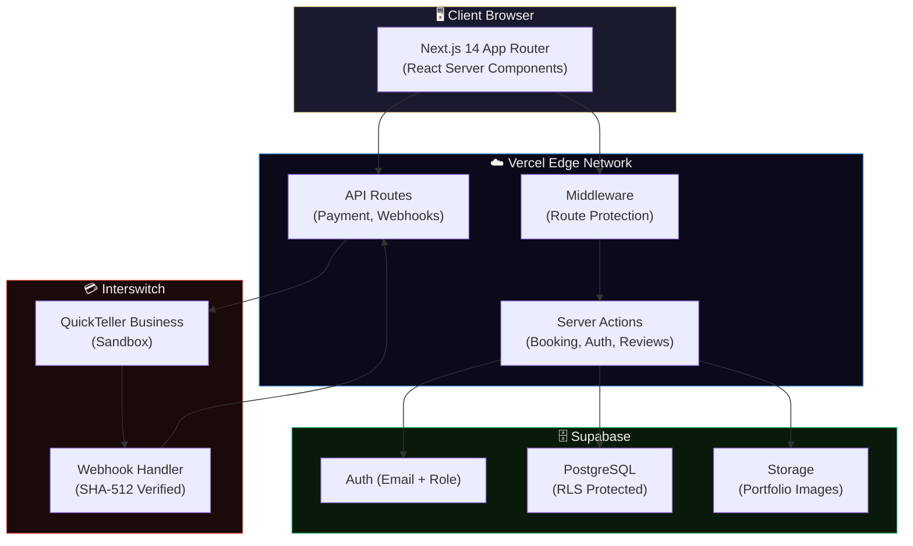
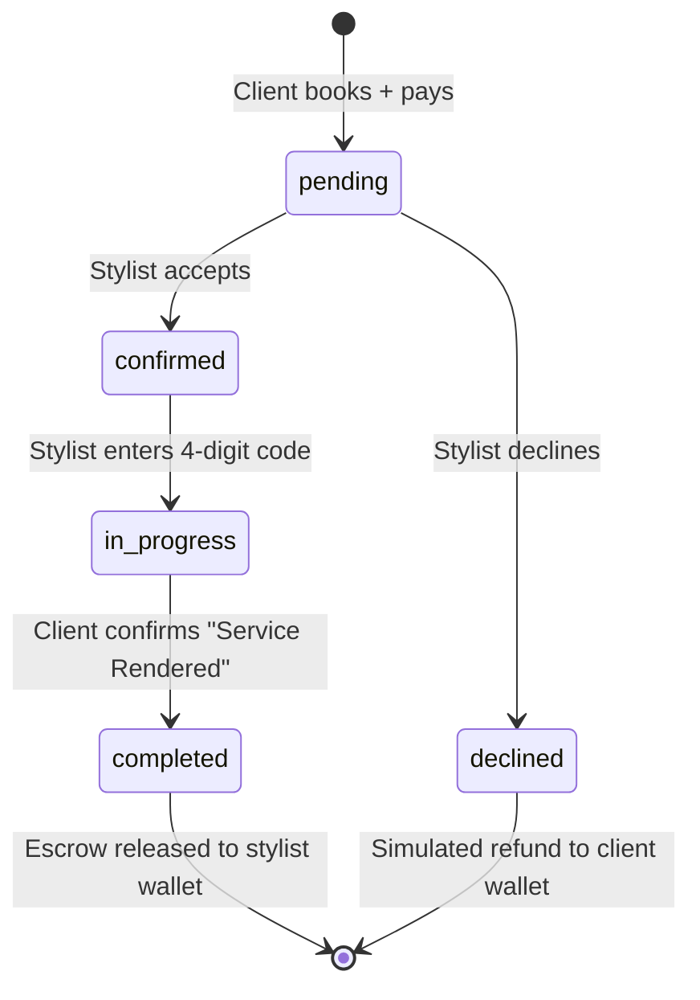

<div align="center">

# 👑 GlamGo

### The Future of Premium Hair Services

**A seamless, localized booking engine connecting clients with premium hair stylists — powered by escrowed payments, verified bookings, and an editorial-grade digital experience.**

[](https://github.com/GlamGo-HQ1/GlamGo)
[](https://github.com/GlamGo-HQ1/GlamGo)
[](https://github.com/GlamGo-HQ1/GlamGo)

---

🔗 **[Live Demo](https://glam-go.vercel.app)** · 📖 **[Full Contribution Log](./CONTRIBUTIONS.md)** · 📐 **[Architecture Docs](./docs/ARCHITECTURE_CONTEXT.md)**

</div>

---

## 🎯 The Problem

**There is zero trust infrastructure in Nigeria's hair industry.**

Finding a stylist isn't the hard part — TikTok, Instagram, and word-of-mouth handle that. The real problem is what happens *after* you find one:

- **Trying a new stylist is a gamble.** You don't know if she can actually deliver what you saw online. You're risking your money, your time, and your hair.
- **Prices change in the chair.** A stylist can say *"your hair is thicker than expected, it's more now."* The client has zero protection against surprise charges.
- **No-shows burn both sides.** Clients ghost appointments. Stylists lose entire afternoons waiting. Nobody gets penalised, so nobody fully commits.
- **Payment has no safety net.** Cash changes hands with no record, no receipt, and no recourse if things go wrong.

Both sides take risks every single transaction. Nobody trusts anybody fully.

---

## 💡 Our Solution

**GlamGo is a visual hair marketplace with built-in payment protection powered by Interswitch.**

We built a **full-stack booking platform** where every naira is protected by an escrow system:

1. **For clients:** Browse a curated gallery of 24+ hairstyles. Find a stylist who does that exact style. See her price **locked upfront** — no surprises. Pay through the app. Your money is **held in escrow** until you confirm the service is done. If she delivers, she gets paid. Simple.

2. **For stylists:** When a client books through GlamGo, they've already paid. That means they're serious. No more wasted time slots. No more *"I'll come tomorrow"* and then disappearing. The money is already there.

**The gallery pulls people in. The payment protects them. One without the other is incomplete.**

> *If we remove payment, GlamGo is just Pinterest for hair. That's a mood board, not a product.*

---

## ✨ Key Features

| Feature | Description |
|:---|:---|
| 🖼️ **Curated Gallery** | 24+ hairstyles across 7 categories with high-resolution imagery — filterable by type (Braids, Locs, Twists, Weaving, etc.) |
| 💳 **Escrowed Payments** | Interswitch QuickTeller sandbox integration. Payment is held until client confirms service delivery. |
| 🔐 **4-Digit Verification** | After service, the client shares a unique code with the stylist. Code entry triggers escrow release. |
| 👩‍🎨 **Stylist Profiles** | Verified portfolios with ratings, reviews, service modes (Salon / Mobile), and style specializations |
| 📊 **Dual Dashboards** | Separate experiences for Clients (booking history, check-in codes) and Stylists (revenue stats, pending requests, booking management) |
| 🎬 **Video Gallery** | Autoplay 360° hairstyle video previews in a horizontal scroll track |
| ✂️ **Service Curation** | Stylists claim global hairstyles, set custom pricing, and manage their service catalog from a dedicated dashboard tab |
| 🚀 **1-Click Booking** | Context-aware navigation: selecting a hairstyle → choosing a stylist → direct booking link, bypassing redundant manual steps |
| 🌙 **Editorial Design** | Dark luxury aesthetic with glassmorphism, Playfair Display typography, and Framer Motion scroll animations |

---

## 🏗️ System Architecture



---

## 🔄 Booking & Escrow Flow

This is the core user journey — from discovery to secure payout:


---

## 🔐 Booking Lifecycle (State Machine)

Every booking transitions through a strict state machine. No step can be skipped.



> **Why simulated refunds?** Reversing a real Interswitch transaction requires multi-day compliance review — not feasible in a hackathon sprint. We chose to simulate refunds via internal wallet credits, clearly documenting this as a known constraint.

---

## 🛠️ Tech Stack

| Layer | Technology | Why We Chose It |
|:---|:---|:---|
| **Framework** | Next.js 14 (App Router) | Server Components for zero-JS gallery pages, Server Actions for mutations |
| **Database** | Supabase PostgreSQL | Auth + DB + Storage in one service — critical for a 4-day build |
| **Auth** | Supabase Auth (Email) | Role-based registration (Client / Stylist) with admin-confirmed emails |
| **Payments** | Interswitch QuickTeller (Sandbox) | Nigeria's premier payment gateway — SHA-512 verified webhooks |
| **Styling** | CSS Modules + Vanilla CSS | Full control for premium editorial design — no utility class compromises |
| **Animation** | Framer Motion | Scroll-driven SVG path drawing, staggered reveals, crossfade galleries |
| **Fonts** | Playfair Display + DM Sans | Luxury editorial typography system |
| **Deployment** | Vercel | Zero-config Next.js hosting with Edge Network |
| **Language** | TypeScript | Strict mode — end-to-end type safety |

---

## 🧠 Engineering Constraints & How We Solved Them

Building a production-quality platform in 4 days forced us to make hard, deliberate engineering decisions:

| Constraint | Challenge | Our Solution |
|:---|:---|:---|
| **4-day timeline** | Full-stack platform with payment integration | Monolith architecture (Next.js + Supabase) — no microservices overhead |
| **Payment refunds** | Interswitch refund API requires multi-day compliance review | Simulated refunds via internal wallet credits. Clearly documented as MVP scope. |
| **Email verification** | Supabase requires email confirmation, but we have no mail server | Used Supabase Admin API to auto-confirm emails at registration |
| **Asset pipeline** | 24+ hairstyle images at 2K+ resolution would crush page load | Built `sharp`-based optimization pipeline to downsample and auto-catalog |
| **RLS gaps** | Initial security audit found 5 critical Row Level Security gaps | Pre-build audit caught all gaps BEFORE code was written — zero production bugs |
| **Gallery performance** | 6 autoplay video cards could stall mobile devices | Muted autoplay + lazy-loaded tracks + scroll-snap for native-feel performance |
| **Editorial design vs speed** | Award-quality visuals typically take weeks, not days | Used Google Stitch for rapid prototyping, then clean integration into Next.js |

---

## 🔒 Security Model

- **Row Level Security (RLS)** on every table — users only access their own data
- **Supabase Auth** handles all authentication with role-based access
- **Service role key** is NEVER exposed to the client
- **SHA-512 hash verification** on all Interswitch webhook payloads
- **Interswitch handles PCI compliance** — we never touch card data
- **Input validation with Zod** on all server action boundaries
- **Pre-build security audit** caught 5 critical RLS gaps before any code was shipped

---

## 👥 Team — Who Built What

> **Every team member's contribution is documented here. For the complete phase-by-phase log with dates and technical details, see [CONTRIBUTIONS.md](./CONTRIBUTIONS.md).**

| Team Member | Role | Key Contributions |
|:---|:---|:---|
| **Overcomer Israel** | Lead Developer & Architect | Built the entire backend: database schema, authentication system, Supabase RLS policies, booking lifecycle (create → confirm → complete), Interswitch payment integration (OAuth tokens, SHA-512 webhooks, inline checkout), dual dashboards (client + stylist), 4-digit escrow verification system, and all API routes. Also conducted pre-build architectural audit that caught 5 critical gaps before any code shipped. |
| **Beloved Godswill** | Product Engineer & Frontend Lead | Built all user-facing pages: editorial landing page (hero, story, booking flow, gallery, mosaic, CTA), platform gallery with category filtering, style detail pages, stylist profile pages, and review system. Implemented the Layer 3 Motion Engine (Framer Motion scroll animations, video gallery, editorial mosaic crossfade). Resolved critical auth and RLS blockers. Built the image optimization pipeline. |
| **Oyewole Oluwabukola Oghenerukevwe** | Industry Advisor & Content Lead | Defined the complete hairstyle taxonomy (7 categories, 24+ styles). Conducted comprehensive UI/UX validation across all platform pages. Specified the booking form fields (hair condition, length, desired style length) that enable stylists to prepare before appointments. Validated visual consistency with the dark luxury editorial direction. |

---

## 📂 Project Structure

```
GlamGo/
├── src/
│   ├── app/                    # Next.js App Router pages
│   │   ├── api/                # REST endpoints (bookings, payments, reviews, stylists)
│   │   ├── auth/               # Login, Register (split-screen editorial), Callback
│   │   ├── booking/            # Booking flow pages ([styleId]/[stylistId])
│   │   ├── dashboard/
│   │   │   ├── client/         # Client dashboard (booking history, check-in codes)
│   │   │   └── stylist/        # Stylist dashboard (stats, requests, services)
│   │   │       └── services/   # Service Curation tab (claim styles, set pricing)
│   │   ├── gallery/            # Hairstyle discovery with category filtering
│   │   ├── payment/            # Interswitch checkout + callback
│   │   ├── review/             # Post-service reviews ([bookingId])
│   │   ├── styles/[id]/        # Style detail pages with multi-angle gallery
│   │   └── stylists/[id]/      # Stylist profiles with context-aware booking CTA
│   ├── components/
│   │   ├── landing/            # Editorial landing page sections (9 components)
│   │   ├── gallery/            # Gallery UI components
│   │   ├── styles/             # Style detail + image gallery components
│   │   ├── stylists/           # Stylist cards, profiles, reviews
│   │   ├── booking/            # Booking form components
│   │   └── layout/             # Navbar, Footer, MobileBottomNav
│   └── lib/
│       ├── supabase/           # Client, Server, Admin, Middleware helpers
│       ├── actions/            # Server Actions (auth, bookings, stylists, dashboard)
│       └── interswitch.ts      # Payment gateway integration
├── public/
│   ├── images/hairstyles/      # Organized by category (24+ styles)
│   └── videos/                 # 360° hairstyle previews
├── docs/                       # Architecture, flows, audit reports
├── scripts/                    # Seed data, image processing
├── CONTRIBUTIONS.md            # Full contribution log
└── design/                     # Stitch design references
```

---

## 🚀 Getting Started

```bash
# Clone the repository
git clone https://github.com/GlamGo-HQ1/GlamGo.git
cd GlamGo

# Install dependencies
npm install

# Set up environment variables
cp .env.example .env.local
# Add your Supabase + Interswitch keys

# Run development server
npm run dev
```

Open [http://localhost:3000](http://localhost:3000) for local development, or visit the **[Live Demo →](https://glam-go.vercel.app)**

### 🧪 Demo Accounts (For Judges)

These pre-seeded accounts are ready to use on the live demo:

| Role | Email | Password |
|:---|:---|:---|
| **Client** | `demo.client@glamgo.ng` | `GlamGo2026!` |
| **Stylist** | `stylist.adaeze@glamgo.ng` | `GlamGo2026!` |
| **Stylist** | `stylist.chioma@glamgo.ng` | `GlamGo2026!` |

> **Recommended Test Flow:** Log in as the Client → Browse Gallery → Select a hairstyle → Choose a stylist → Book & Pay → Then log in as the Stylist to accept the booking and enter the 4-digit verification code.

> 💳 **Need test card details for payment?** See the [Testing Guide](./docs/TESTING_GUIDE.md) for Interswitch sandbox card number, expiry, CVV, PIN, and OTP.

### Environment Variables

| Variable | Description |
|:---|:---|
| `NEXT_PUBLIC_SUPABASE_URL` | Supabase project URL |
| `NEXT_PUBLIC_SUPABASE_ANON_KEY` | Supabase anonymous key |
| `SUPABASE_SERVICE_ROLE_KEY` | Supabase admin key (server-only) |
| `INTERSWITCH_MERCHANT_CODE` | Interswitch merchant identifier |
| `INTERSWITCH_PAY_ITEM_ID` | QuickTeller pay item ID |
| `INTERSWITCH_CLIENT_ID` | OAuth client ID |
| `INTERSWITCH_SECRET_KEY` | OAuth secret key |

---

## 📖 Documentation

| Document | Description |
|:---|:---|
| [TESTING_GUIDE.md](./docs/TESTING_GUIDE.md) | **For Judges:** Demo accounts, Interswitch test card details, and recommended test flow |
| [HACKATHON_FRAMEWORK.md](./docs/HACKATHON_FRAMEWORK.md) | Team alignment document: how we identified the trust problem, scoped the MVP, and assigned roles |
| [CONTRIBUTIONS.md](./CONTRIBUTIONS.md) | Complete phase-by-phase contribution log with dates, technical decisions, and bug fixes |
| [USER_FLOWS.md](./docs/USER_FLOWS.md) | Client booking flow and stylist fulfillment flow (with mermaid diagrams) |
| [ARCHITECTURE_CONTEXT.md](./docs/ARCHITECTURE_CONTEXT.md) | System architecture decisions and security model |
| [DATABASE_SCHEMA.md](./docs/DATABASE_SCHEMA.md) | Complete database schema documentation |
| [PRODUCT_DECISIONS.md](./docs/PRODUCT_DECISIONS.md) | Business logic decisions and rationale |
| [HAIRSTYLE_CATALOG.md](./docs/HAIRSTYLE_CATALOG.md) | Full catalog of 24+ hairstyles across 7 categories |

---

## 📋 Pre-Hackathon Planning (Compliance Note)

> **Important for Judges:** You may notice repository activity and documentation files dated before the official hackathon build dates (March 23–26, 2026). We want to be fully transparent about what this activity represents.

The Enyata × Interswitch Buildathon 2026 explicitly permitted pre-hackathon ideation, research, and planning. Our team used this window to conduct industry research, define the problem space, and align on scope — **no code was written** before March 23.

All pre-hackathon work is documented in these files:

| Document | Date | What It Contains |
|:---|:---|:---|
| [GLAMGO_CONCEPT.md](./docs/GLAMGO_CONCEPT.md) | Pre-build | Full idea document: problem definition, user journeys, competitive analysis, data model planning |
| [HACKATHON_FRAMEWORK.md](./docs/HACKATHON_FRAMEWORK.md) | March 21 | Team alignment meeting notes — how we identified the trust problem and scoped the MVP |
| [PRODUCT_VISION.md](./docs/PRODUCT_VISION.md) | Pre-build | V1 (hackathon) vs V2 (post-hackathon) feature scoping |
| [LEAD_DEVELOPER_BRIEF.md](./docs/LEAD_DEVELOPER_BRIEF.md) | Pre-build | Execution plan and phase sequence for the lead developer |
| [interswitch-workshop-intel.md](./docs/interswitch-workshop-intel.md) | March 25 | Notes from the Interswitch API workshop session (OAuth, webhooks, escrow strategy) |

**All code, database setup, and deployments began on March 23, 2026** — the first day of the official build period.

---

<div align="center">

*Built with 🖤 in 4 days for the Enyata × Interswitch Buildathon 2026 (Health + Payments Track)*

🔗 **[Try the Live Demo →](https://glam-go.vercel.app)** · 📖 **[Read the Full Contribution Log →](./CONTRIBUTIONS.md)**

</div>
