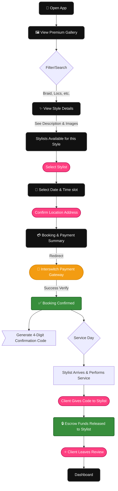
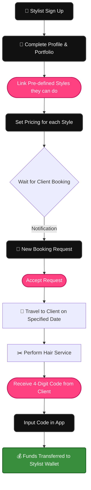

# GlamGo Hackathon User Flows
This document outlines the core user journey paths that we are building for the Hackathon MVP.

---

## 1. Client Booking (Happy Path MVP)
This is the **primary flow** that the judges will see during the demo. It emphasizes the journey from inspiration to secure escrow payment.

---

## 2. Stylist Onboarding & Fulfillment
The secondary flow showing how stylists get onto the platform and receive their payouts.

